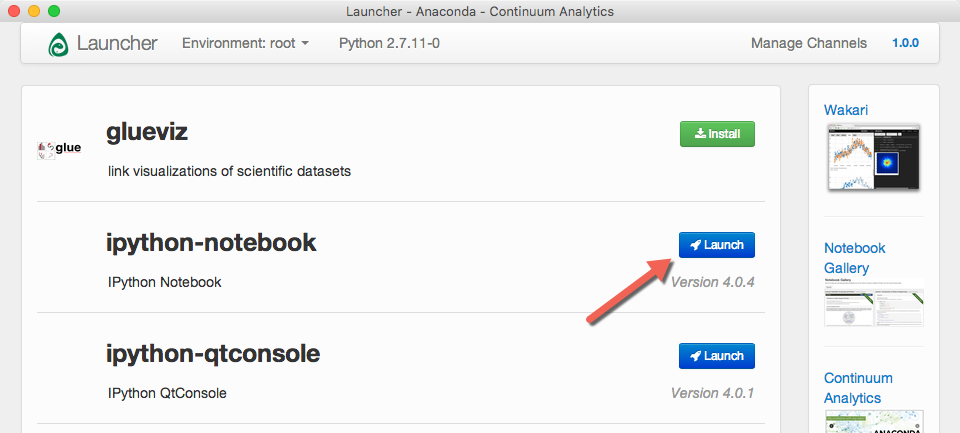
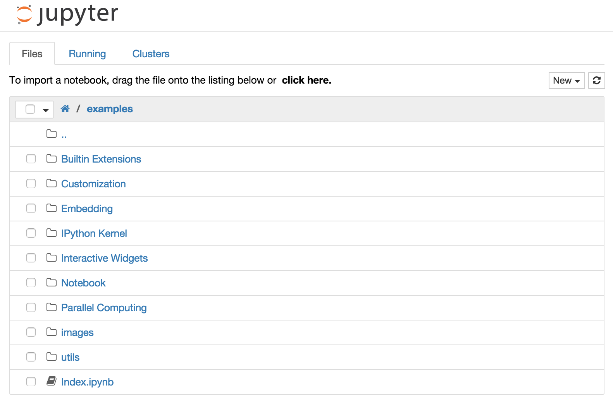
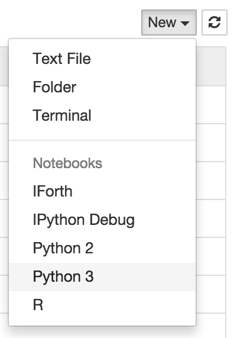
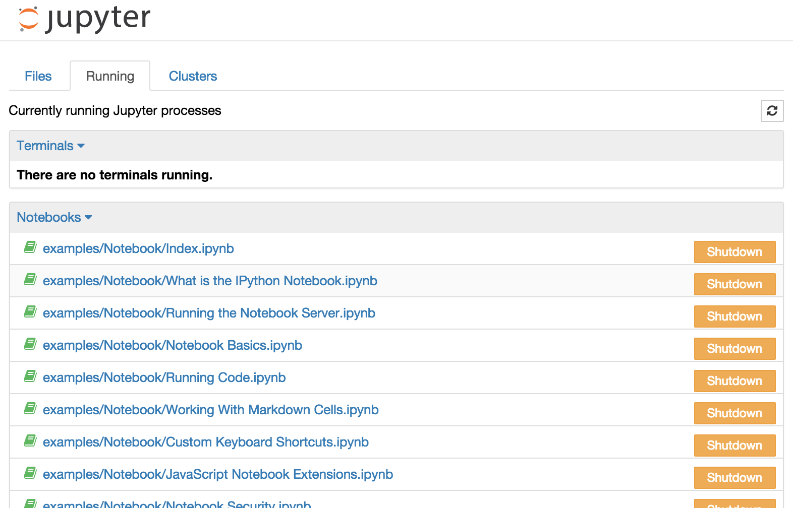
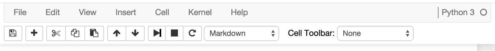

# Notebook Basics

<div class="alert alert-info">
This notebook is an extract taken from the original "Notebook Basics" documentation that can be found at <a href="http://nbviewer.jupyter.org/github/jupyter/notebook/blob/master/docs/source/examples/Notebook/Notebook%20Basics.ipynb">this link</a></div>

There are many, many tools available for developing Python. They range in power (and complexity) from the interactive interface you get by simply typing "python" at the command line in your operating system to the extremely complex integrated development environments, such as PyCharm or Eclipse.

For this course, we'll be using a very popular "notebook" based interface called Jupyter. Before you ask, Jupyter admittedly has some significant limitations that mean that it's probably not the tool that you should be using if you're constructing a complex application. But, to be blunt about it, we're not building complex applications right now. Instead, we have basically two goals: (1) to learn enough basic Python to be dangerous and (2) to use Python to perform various flavors of data processing and analysis. As it turns out, Jupyter is essentially ideal for these tasks:

1. It's extremely simple to use
2. It's very interactive, so we can get immediate feedback when we try something in Python.
3. It's very interactive, so when we eventually move on to data analysis later, it will provide a great environment for interactively exploring, manipulating and visualizing our data
4. It will allow us to share things very easily
5. It will allow us to embed runnable Python into a document which can include both formatted text, multimedia, and rendered equations, so it's really straightforward to create self-contained, self-documented examples.

As a result, Jupyter has been broadly adopted as a tool for both teaching basic Python and performing basic data analyses.

## Running the Notebook Server

The Jupyter notebook server is a custom web server that runs the notebook web application. Most of the time, users run the notebook server on their local computer using the command line interface.

### Starting the notebook server using the Anaconda Launcher

If you fully installed the Anaconda distribution, then one of the pieces of software that was installed is a launcher which will, among other things, allow you to startup up multiple environments for creating and testing Python. Somewhere on your desktop you should be able to find an icon that looks like this:


Click it, and you'll brought to the Anaconda Launcher. It should look more or less like the following (although your screen won't actually have the red arrow):



Click on the `Launch` button to start the Jupyter notebook server and to open a browser.

### Starting the notebook server using the command line

Alternatively, you can start the notebook server from the command line (Terminal on Mac/Linux, CMD prompt on Windows) by running the following command:

    jupyter notebook

This will print some information about the notebook server in your terminal, including the URL of the web application (by default, `http://127.0.0.1:8888`). It will then open your default web browser to this URL.

When the notebook opens, you will see the **notebook dashboard**, which will show a list of the notebooks, files, and subdirectories in the directory where the notebook server was started (as seen in the next section, below). Most of the time, you will want to start a notebook server in the highest directory in your filesystem where notebooks can be found. Often this will be your home directory.

### Additional options

By default, the notebook server starts on port 8888.  If port 8888 is unavailable, the notebook server searches the next available port.

You can also specify the port manually:

    jupyter notebook --port 9999

Or start notebook server without opening a web browser.

    jupyter notebook --no-browser

The notebook server has a number of other command line arguments that can be displayed with the `--help` flag:

    jupyter notebook --help

## The Notebook dashboard

When you first start the notebook server, your browser will open to the notebook dashboard. The dashboard serves as a home page for the notebook. Its main purpose is to display the notebooks and files in the current directory. For example, here is a screenshot of the dashboard page for the `examples` directory in the Jupyter repository:



The top of the notebook list displays clickable breadcrumbs of the current directory. By clicking on these breadcrumbs or on sub-directories in the notebook list, you can navigate your file system.

To create a new notebook, click on the "New" button at the top of the list and select a kernel from the dropdown (as seen below).  Which kernels are listed depend on what's installed on the server.  Some of the kernels in the screenshot below may not exist as an option to you.



Notebooks and files can be uploaded to the current directory by dragging a notebook file onto the notebook list or by the "click here" text above the list.

The notebook list shows green "Running" text and a green notebook icon next to running notebooks (as seen below). Notebooks remain running until you explicitly shut them down; closing the notebook's page is not sufficient.


To shutdown, delete, duplicate, or rename a notebook check the checkbox next to it and an array of controls will appear at the top of the notebook list.  You can also use the same operations on directories and files when applicable.


To see all of your running notebooks along with their directories, click on the "Running" tab:



This view provides a convenient way to track notebooks that you start as you navigate the file system in a long running notebook server.

## Overview of the Notebook UI

If you create a new notebook or open an existing one, you will be taken to the notebook user interface (UI). This UI allows you to run code and author notebook documents interactively. The notebook UI has the following main areas:

* Menu
* Toolbar
* Notebook area and cells

The notebook has an interactive tour of these elements that can be started in the "Help:User Interface Tour" menu item.

## Modal editor

Starting with IPython 2.0, the Jupyter Notebook has a modal user interface. This means that the keyboard does different things depending on which mode the Notebook is in. There are two modes: edit mode and command mode.

### Edit mode

Edit mode is indicated by a green cell border and a prompt showing in the editor area:


When a cell is in edit mode, you can type into the cell, like a normal text editor.

<div class="alert alert-success">
Enter edit mode by pressing `Enter` or using the mouse to click on a cell's editor area.
</div>

### Command mode

Command mode is indicated by a grey cell border with a blue left margin:


When you are in command mode, you are able to edit the notebook as a whole, but not type into individual cells. Most importantly, in command mode, the keyboard is mapped to a set of shortcuts that let you perform notebook and cell actions efficiently. For example, if you are in command mode and you press `c`, you will copy the current cell - no modifier is needed.

<div class="alert alert-error">
Don't try to type into a cell in command mode; unexpected things will happen!
</div>

<div class="alert alert-success">
Enter command mode by pressing `Esc` or using the mouse to click *outside* a cell's editor area.
</div>

## Mouse navigation

All navigation and actions in the Notebook are available using the mouse through the menubar and toolbar, which are both above the main Notebook area:



Before you ask, your personal toolbar may not be quite the same as the image you're seeing here. For instance, if you've followed the directions, you're running Python 2 not Python 3.

The first idea of mouse based navigation is that **cells can be selected by clicking on them.** The currently selected cell gets a grey or green border depending on whether the notebook is in edit or command mode. If you click inside a cell's editor area, you will enter edit mode. If you click on the prompt or output area of a cell you will enter command mode.

If you are running this notebook in a live session (not on http://nbviewer.jupyter.org) try selecting different cells and going between edit and command mode. Try typing into a cell.

The second idea of mouse based navigation is that **cell actions usually apply to the currently selected cell**. Thus if you want to run the code in a cell, you would select it and click the <button class='btn btn-default btn-xs'><i class="fa fa-step-forward icon-step-forward"></i></button> button in the toolbar or the "Cell:Run" menu item. Similarly, to copy a cell you would select it and click the <button class='btn btn-default btn-xs'><i class="fa fa-copy icon-copy"></i></button> button in the toolbar or the "Edit:Copy" menu item. With this simple pattern, you should be able to do most everything you need with the mouse.

Markdown and heading cells have one other state that can be modified with the mouse. These cells can either be rendered or unrendered. When they are rendered, you will see a nice formatted representation of the cell's contents. When they are unrendered, you will see the raw text source of the cell. To render the selected cell with the mouse, click the <button class='btn btn-default btn-xs'><i class="fa fa-step-forward icon-step-forward"></i></button> button in the toolbar or the "Cell:Run" menu item. To unrender the selected cell, double click on the cell.

## Keyboard Navigation

The modal user interface of the Jupyter Notebook has been optimized for efficient keyboard usage. This is made possible by having two different sets of keyboard shortcuts: one set that is active in edit mode and another in command mode.

The most important keyboard shortcuts are `Enter`, which enters edit mode, and `Esc`, which enters command mode.

In edit mode, most of the keyboard is dedicated to typing into the cell's editor. Thus, in edit mode there are relatively few shortcuts.  In command mode, the entire keyboard is available for shortcuts, so there are many more.  The `Help`->`Keyboard Shortcuts` dialog lists the available shortcuts.

### A Summary Of Useful Keyboard Shortcuts for Jupyter Notebooks
- RETURN: will enter a newline in the current cell
- Ctrl+ENTER: will evaluate the cell
- Shift+ENTER: will evaluate a cell and select the cell below
- Up Arrow: select previous cell
- Down Arrow: select next cell
- Shift + =: merge current cell with the cell below
- **dd**: delete the current cell
- Ctrl+S (windows) or Cmd+S (OSX): will save the notebook
- TAB will attempt to "auto-complete" whatever you're doing. What happens is context dependent.
    - it may simply complete the variable name, the function name or whatever it is that you were typing if it's unambiguous
    - If there are multiple ways to complete the text, then it will show you several alternatives. It may show a popup of the various alternatives for completing the text you were typing. This may variable names, it may be methods on an object (we'll cover objects later), etc. You can choose between these alternatives using either your mouse or by moving around with your arrow keys
- Shift+TAB will show a small popup containing help information.

### Some examples to play with.

First let's define a few variables to play with. Don't worry if you're not quite sure about how this works just yet. We'll get to variables later. For now, we're just practicing a bit with notebooks.

**Example:** click on the cell below and hit Shift-Return to create these variables

```python
>>> sampleVariable = 100
>>> sampleList = [1,2,3]
...
>>> print 'sampleVariable = ', sampleVariable
>>> print 'sampleList = ', sampleList
```

Now, we can try some of the shortcuts. For example, in the cell below, please type in "sampleV" and then hit the TAB key. It will auto-complete to "sampleVariable". From here you can Shift-Enter to evaluate sampleVariable

```python

```

Now, please type in "sample" and then hit the TAB key. You should see both sampleVariable and sampleList as options. Choose one using your keyboard and then evaluate the cell.

```python

```

Finally, although we're getting a bit ahead of ourselves here in terms of Python, it's useful to note that when we are dealing with Python objects we can get the list of methods available on an object using the same TAB trick. For instance, in our example sampleList is a Python object representing a list. Type in "sampleList." and then tab to see the list of methods you can run on this list. If you don't get anything, be sure that you included the "." at the end. For now, don't worry about the notion of an "object" or what any of these methods do, we'll come back to this later.

## References

1. [Documentation for the Jupyter Project](http://jupyter.readthedocs.org/en/latest)
2. [Documentation for Jupyter Notebook](http://jupyter-notebook.readthedocs.org/en/latest/notebook.html)
