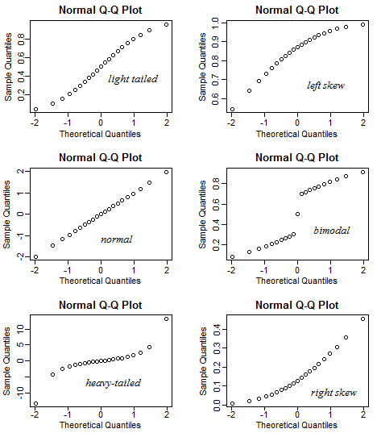

# Titanic

## Boilerplate

```python
>>> import numpy as np
>>> import pandas as pd
>>> import matplotlib as mpl
>>> import matplotlib.pyplot as plt
>>> import statsmodels.api as sm
>>> from statsmodels.formula.api import ols
>>> from statsmodels.formula.api import logit
...
>>> import pylab as pl
>>> import seaborn as sns
...
>>> mpl.style.use('fivethirtyeight')
>>> %matplotlib inline
```

## Read the data

```python
>>> # Let's set up a URL to the file, which in this case is hosted on Github
... base_url = 'https://raw.githubusercontent.com/johnjfox/Analytic_Enterprise/master/data/'
>>> data_url = 'titanic/titanic_train.csv'
>>> url = base_url + data_url
...
>>> train_df = pd.read_csv(url)
>>> train_df.sample(5)
     PassengerId  Survived  Pclass  \
375          376         1       1   
156          157         1       3   
868          869         0       3   
666          667         0       2   
440          441         1       2   

                                            Name     Sex  Age  SibSp  Parch  \
375        Meyer, Mrs. Edgar Joseph (Leila Saks)  female  NaN      1      0   
156             Gilnagh, Miss. Katherine "Katie"  female   16      0      0   
868                  van Melkebeke, Mr. Philemon    male  NaN      0      0   
666                  Butler, Mr. Reginald Fenton    male   25      0      0   
440  Hart, Mrs. Benjamin (Esther Ada Bloomfield)  female   45      1      1   

           Ticket     Fare Cabin Embarked  
375      PC 17604  82.1708   NaN        C  
156         35851   7.7333   NaN        Q  
868        345777   9.5000   NaN        S  
666        234686  13.0000   NaN        S  
440  F.C.C. 13529  26.2500   NaN        S
```

```python
>>> train_df.describe()
       PassengerId    Survived      Pclass         Age       SibSp  \
count   891.000000  891.000000  891.000000  714.000000  891.000000   
mean    446.000000    0.383838    2.308642   29.699118    0.523008   
std     257.353842    0.486592    0.836071   14.526497    1.102743   
min       1.000000    0.000000    1.000000    0.420000    0.000000   
25%     223.500000    0.000000    2.000000   20.125000    0.000000   
50%     446.000000    0.000000    3.000000   28.000000    0.000000   
75%     668.500000    1.000000    3.000000   38.000000    1.000000   
max     891.000000    1.000000    3.000000   80.000000    8.000000   

            Parch        Fare  
count  891.000000  891.000000  
mean     0.381594   32.204208  
std      0.806057   49.693429  
min      0.000000    0.000000  
25%      0.000000    7.910400  
50%      0.000000   14.454200  
75%      0.000000   31.000000  
max      6.000000  512.329200
```

## Transforming the Original Data Using a Mapped Dictionary

```python
>>> # just for the fun of it, let's create a new column consisting of a remapped 'sex' variable
... train_df['Gender'] = train_df['Sex'].map({'female':0, 'male':1}).astype(int)
>>> train_df.head(5)
   PassengerId  Survived  Pclass  \
0            1         0       3   
1            2         1       1   
2            3         1       3   
3            4         1       1   
4            5         0       3   

                                                Name     Sex  Age  SibSp  \
0                            Braund, Mr. Owen Harris    male   22      1   
1  Cumings, Mrs. John Bradley (Florence Briggs Th...  female   38      1   
2                             Heikkinen, Miss. Laina  female   26      0   
3       Futrelle, Mrs. Jacques Heath (Lily May Peel)  female   35      1   
4                           Allen, Mr. William Henry    male   35      0   

   Parch            Ticket     Fare Cabin Embarked  Gender  
0      0         A/5 21171   7.2500   NaN        S       1  
1      0          PC 17599  71.2833   C85        C       0  
2      0  STON/O2. 3101282   7.9250   NaN        S       0  
3      0            113803  53.1000  C123        S       0  
4      0            373450   8.0500   NaN        S       1
```

```python
>>> # mapping from an integer to a "categorical"
... train_df['alive?'] = train_df['Survived'].map({0:'dead', 1:'alive'})
>>> train_df.sample(5)
     PassengerId  Survived  Pclass                         Name   Sex  Age  \
207          208         1       3  Albimona, Mr. Nassef Cassem  male   26   
668          669         0       3              Cook, Mr. Jacob  male   43   
372          373         0       3   Beavan, Mr. William Thomas  male   19   
262          263         0       1            Taussig, Mr. Emil  male   52   
93            94         0       3      Dean, Mr. Bertram Frank  male   26   

     SibSp  Parch     Ticket     Fare Cabin Embarked  Gender alive?  
207      0      0       2699  18.7875   NaN        C       1  alive  
668      0      0   A/5 3536   8.0500   NaN        S       1   dead  
372      0      0     323951   8.0500   NaN        S       1   dead  
262      1      1     110413  79.6500   E67        S       1   dead  
93       1      2  C.A. 2315  20.5750   NaN        S       1   dead
```

## Transforming the Original Data Using a User Defined Function

```python
>>> # finally, let's demonstrate the construction and application of a simple function to each element
...
... def age_bin(age):
...     if (age < 1):
...         return 'infant'
...     if (age < 13):
...         return 'child'
...     if (age < 20):
...         return 'teen'
...     if (age < 40):
...         return 'adult'
...     if (age < 60):
...         return 'middle_aged'
...     return 'old'
```

```python
>>> # the map function applies a function (in this case age_bin) to each element of the dataframe
... # in this case the data being passed in is train_df.Age
... train_df['Age Bin'] = train_df.Age.map(age_bin)
>>> train_df.sample(5)
     PassengerId  Survived  Pclass  \
165          166         1       3   
888          889         0       3   
416          417         1       2   
578          579         0       3   
467          468         0       1   

                                                Name     Sex  Age  SibSp  \
165  Goldsmith, Master. Frank John William "Frankie"    male    9      0   
888         Johnston, Miss. Catherine Helen "Carrie"  female  NaN      1   
416  Drew, Mrs. James Vivian (Lulu Thorne Christian)  female   34      1   
578                 Caram, Mrs. Joseph (Maria Elias)  female  NaN      1   
467                       Smart, Mr. John Montgomery    male   56      0   

     Parch      Ticket     Fare Cabin Embarked  Gender alive?      Age Bin  
165      2      363291  20.5250   NaN        S       1  alive        child  
888      2  W./C. 6607  23.4500   NaN        S       0   dead          old  
416      1       28220  32.5000   NaN        S       0  alive        adult  
578      0        2689  14.4583   NaN        C       0   dead          old  
467      0      113792  26.5500   NaN        S       1   dead  middle_aged
```

## One Implication is That The Pivots Are Much More Readable

```python
>>> pivot = pd.pivot_table(data=train_df, columns = ['Sex','alive?'], index=['Pclass'],  values='Survived', aggfunc='count', margins=True)
>>> pivot
Sex    female       male       All
alive?  alive dead alive dead     
Pclass                            
1          91    3    45   77  216
2          70    6    17   91  184
3          72   72    47  300  491
All       233   81   109  468  891
```

```python
>>> pivot = pivot.fillna(0.0)
```

```python
>>> female = pivot.loc[:,('female','alive')] / (pivot.loc[:,('female','alive')] + pivot.loc[:,('female','dead')])
>>> male = pivot.loc[:,('male','alive')] / (pivot.loc[:,('male','alive')] + pivot.loc[:,('male','dead')])
>>> survival = pd.DataFrame({'Female': female, 'Male': male})
>>> survival
>>> sns.heatmap(survival)
```

```python
>>> print train_df.count()
PassengerId    891
Survived       891
Pclass         891
Name           891
Sex            891
Age            714
SibSp          891
Parch          891
Ticket         891
Fare           891
Cabin          204
Embarked       889
Gender         891
alive?         891
Age Bin        891
dtype: int64
```

## Eliminate the missing elements in the column that we care about

```python
>>> train_df = train_df[~np.isnan(train_df.Age)]
>>> train_df.count()
PassengerId    714
Survived       714
Pclass         714
Name           714
Sex            714
Age            714
SibSp          714
Parch          714
Ticket         714
Fare           714
Cabin          185
Embarked       712
Gender         714
alive?         714
Age Bin        714
dtype: int64
```

## Plot the distribution of ages

```python
>>> plt.figure(figsize=(8,6))
>>> sns.distplot(train_df.Age)
```

## Plot the scatterplot matrix as well to identify likely predictors

## Creating Dummy Variables

In each case, when we build the dummy variables, we'll always leave one out to avoid issues with co-linearity.

```python
>>> train_df.sample(5)
     PassengerId  Survived  Pclass  \
205          206         0       3   
406          407         0       3   
729          730         0       3   
192          193         1       3   
0              1         0       3   

                                                Name     Sex  Age  SibSp  \
205                       Strom, Miss. Telma Matilda  female    2      0   
406                 Widegren, Mr. Carl/Charles Peter    male   51      0   
729                    Ilmakangas, Miss. Pieta Sofia  female   25      1   
192  Andersen-Jensen, Miss. Carla Christine Nielsine  female   19      1   
0                            Braund, Mr. Owen Harris    male   22      1   

     Parch            Ticket     Fare Cabin Embarked  Gender alive?  \
205      1            347054  10.4625    G6        S       0   dead   
406      0            347064   7.7500   NaN        S       1   dead   
729      0  STON/O2. 3101271   7.9250   NaN        S       0   dead   
192      0            350046   7.8542   NaN        S       0  alive   
0        0         A/5 21171   7.2500   NaN        S       1   dead   

         Age Bin  
205        child  
406  middle_aged  
729        adult  
192         teen  
0          adult
```

```python
>>> class_dummies = pd.get_dummies(train_df['Pclass'], prefix='class').iloc[:, 1:]
>>> class_dummies.head(5)
   class_2  class_3
0        0        1
1        0        0
2        0        1
3        0        0
4        0        1
```

```python
>>> sex_dummies = pd.get_dummies(train_df['Sex']).iloc[:, 1:]
>>> sex_dummies.head(5)
   male
0     1
1     0
2     0
3     0
4     1
```

```python
>>> embarked_dummies = pd.get_dummies(train_df['Embarked']).iloc[:, 1:]
>>> embarked_dummies.head(5)
   Q  S
0  0  1
1  0  0
2  0  1
3  0  1
4  0  1
```

```python
>>> data = train_df.join([class_dummies, sex_dummies, embarked_dummies])
>>> data.sample(5)
     PassengerId  Survived  Pclass                          Name   Sex  Age  \
280          281         0       3              Duane, Mr. Frank  male   65   
756          757         0       3  Carlsson, Mr. August Sigfrid  male   28   
637          638         0       2           Collyer, Mr. Harvey  male   31   
544          545         0       1    Douglas, Mr. Walter Donald  male   50   
99           100         0       2             Kantor, Mr. Sinai  male   34   

     SibSp  Parch      Ticket      Fare Cabin Embarked  Gender alive?  \
280      0      0      336439    7.7500   NaN        Q       1   dead   
756      0      0      350042    7.7958   NaN        S       1   dead   
637      1      1  C.A. 31921   26.2500   NaN        S       1   dead   
544      1      0    PC 17761  106.4250   C86        C       1   dead   
99       1      0      244367   26.0000   NaN        S       1   dead   

         Age Bin  class_2  class_3  male  Q  S  
280          old        0        1     1  1  0  
756        adult        0        1     1  0  1  
637        adult        1        0     1  0  1  
544  middle_aged        0        0     1  0  0  
99         adult        1        0     1  0  1
```

## Model Structure

The model can be determine in two ways. Arguably, the most easy to read is through the R-style formula definitions as defined by [Stats Model Formulas](http://statsmodels.sourceforge.net/devel/example_formulas.html).

The model is formally defined using the `patsy` language at [Patsy Docs](http://patsy.readthedocs.org/en/latest/overview.html)

The formula takes the form
   
    dependent_var ~ indep_var1 + indep_var2 + ...

Key elements for constructing the structure of the model:

*  '+' adds new variables 
*  '-' can subtract variables, for instance '-1' removes the intercept
*  '*' takes the product of the two variables
*  np.fn(.) will take a vectorized function of a variable
* 'C(.)' will force the treatment of a variable as categorical (rather then numeric)

## Linear Regression through Ordinary Least Squares

```python
>>> # Ordinary least squares using R-style equations
... #
... model = ols(data=data, formula='Survived ~ Age + class_2 + class_3 + male + Q + S')
...
>>> # fit the model
... result = model.fit()
```

```python
>>> result.summary()
<class 'statsmodels.iolib.summary.Summary'>
"""
                            OLS Regression Results                            
==============================================================================
Dep. Variable:               Survived   R-squared:                       0.394
Model:                            OLS   Adj. R-squared:                  0.389
Method:                 Least Squares   F-statistic:                     76.67
Date:                Sat, 09 Apr 2016   Prob (F-statistic):           1.14e-73
Time:                        13:49:38   Log-Likelihood:                -326.50
No. Observations:                 714   AIC:                             667.0
Df Residuals:                     707   BIC:                             699.0
Df Model:                           6                                         
Covariance Type:            nonrobust                                         
==============================================================================
                 coef    std err          t      P>|t|      [95.0% Conf. Int.]
------------------------------------------------------------------------------
Intercept      1.1652      0.054     21.491      0.000         1.059     1.272
Age           -0.0053      0.001     -4.878      0.000        -0.007    -0.003
class_2       -0.1802      0.044     -4.125      0.000        -0.266    -0.094
class_3       -0.3789      0.040     -9.394      0.000        -0.458    -0.300
male          -0.4760      0.031    -15.457      0.000        -0.536    -0.416
Q             -0.1212      0.082     -1.473      0.141        -0.283     0.040
S             -0.0813      0.040     -2.045      0.041        -0.159    -0.003
==============================================================================
Omnibus:                       25.115   Durbin-Watson:                   1.850
Prob(Omnibus):                  0.000   Jarque-Bera (JB):               27.078
Skew:                           0.477   Prob(JB):                     1.32e-06
Kurtosis:                       3.039   Cond. No.                         198.
==============================================================================

Warnings:
[1] Standard Errors assume that the covariance matrix of the errors is correctly specified.
"""
```

## Testing Our Residuals

```python
>>> # the model fit will actually produce the residuals without
... # any additional work
... residuals = result.resid
```

```python
>>> fig = sns.distplot(residuals)
```

## The QQ Plot

A great explanation adapted from one provided by Clay Ford at the University of Virginia.

> The Q-Q plot, or quantile-quantile plot, is a graphical tool to help assess if a set of data plausibly came from some theoretical distribution such as a Normal or exponential. For example, if we run a statistical analysis that assumes our dependent variable is Normally distributed, we can use a Normal Q-Q plot to check that assumption. It’s just a visual check, not an air-tight proof, so it is somewhat subjective. But it allows us to see at-a-glance if our assumption is plausible, and if not, how the assumption is violated and what data points contribute to the violation.

> A Q-Q plot is a scatterplot created by plotting two sets of quantiles against one another. If both sets of quantiles came from the same distribution, we should see the points forming a line that’s roughly straight. Now what are “quantiles”? These are often referred to as “percentiles”. These are points in your data below which a certain proportion of your data fall. For example, imagine the classic bell-curve standard Normal distribution with a mean of 0. The 0.5 quantile, or 50th percentile, is 0. Half the data lie below 0. That’s the peak of the hump in the curve. The 0.95 quantile, or 95th percentile, is about 1.64. 95 percent of the data lie below 1.64. The following R code generates the quantiles for a standard Normal distribution from 0.01 to 0.99 by increments of 0.01.

> In other words, quantiles are basically just your data sorted in ascending order, with various data points labelled as being the point below which a certain proportion of the data fall. However it’s worth noting there are many ways to calculate quantiles. 

> Q-Q plots take your sample data, sort it in ascending order, and then plot them versus quantiles calculated from a theoretical distribution. The number of quantiles is selected to match the size of your sample data. While Normal Q-Q Plots are the ones most often used in practice due to so many statistical methods assuming normality, Q-Q Plots can actually be created for any distribution.

### Interpreting the QQ Plot



```python
>>> # Checking the residuals
... fig, axes = plt.subplots(nrows=1, ncols=2, figsize=(10,5))
>>> sns.distplot(residuals, ax=axes[0]);
>>> sm.qqplot(residuals, fit=True, line='s', ax=axes[1]);
```

## Using model for predicting results on the test data set

```python
>>> # Let's set up a URL to the file, which in this case is hosted on Github
... test_url = 'titanic/titanic_test.csv'
>>> url_test = base_url + test_url
...
>>> test_df = pd.read_csv(url_test)
>>> test_df.describe()
       PassengerId      Pclass         Age       SibSp       Parch        Fare
count   418.000000  418.000000  332.000000  418.000000  418.000000  417.000000
mean   1100.500000    2.265550   30.272590    0.447368    0.392344   35.627188
std     120.810458    0.841838   14.181209    0.896760    0.981429   55.907576
min     892.000000    1.000000    0.170000    0.000000    0.000000    0.000000
25%     996.250000    1.000000   21.000000    0.000000    0.000000    7.895800
50%    1100.500000    3.000000   27.000000    0.000000    0.000000   14.454200
75%    1204.750000    3.000000   39.000000    1.000000    0.000000   31.500000
max    1309.000000    3.000000   76.000000    8.000000    9.000000  512.329200
```

```python
>>> test_df.sample(5)
     PassengerId  Pclass                                           Name  \
141         1033       1                           Daniels, Miss. Sarah   
54           946       2              Mangiavacchi, Mr. Serafino Emilio   
88           980       3                        O'Donoghue, Ms. Bridget   
234         1126       1                      Cumings, Mr. John Bradley   
272         1164       1  Clark, Mrs. Walter Miller (Virginia McDowell)   

        Sex  Age  SibSp  Parch       Ticket      Fare Cabin Embarked  
141  female   33      0      0       113781  151.5500   NaN        S  
54     male  NaN      0      0  SC/A.3 2861   15.5792   NaN        C  
88   female  NaN      0      0       364856    7.7500   NaN        Q  
234    male   39      1      0     PC 17599   71.2833   C85        C  
272  female   26      1      0        13508  136.7792   C89        C
```

```python
>>> test_df = test_df[~np.isnan(test_df.Age)]
>>> test_df.count()
PassengerId    332
Pclass         332
Name           332
Sex            332
Age            332
SibSp          332
Parch          332
Ticket         332
Fare           331
Cabin           87
Embarked       332
dtype: int64
```


```python
>>> class_dummies = pd.get_dummies(test_df['Pclass'], prefix='class').iloc[:, 1:]
>>> sex_dummies = pd.get_dummies(test_df['Sex']).iloc[:, 1:]
>>> embarked_dummies = pd.get_dummies(test_df['Embarked']).iloc[:, 1:]
...
>>> test_data = test_df.join([class_dummies, sex_dummies, embarked_dummies])
>>> test_data.describe()
       PassengerId      Pclass         Age       SibSp       Parch  \
count   332.000000  332.000000  332.000000  332.000000  332.000000   
mean   1100.063253    2.144578   30.272590    0.481928    0.397590   
std     122.763173    0.846283   14.181209    0.874084    0.810651   
min     892.000000    1.000000    0.170000    0.000000    0.000000   
25%     992.750000    1.000000   21.000000    0.000000    0.000000   
50%    1099.500000    2.000000   27.000000    0.000000    0.000000   
75%    1210.250000    3.000000   39.000000    1.000000    1.000000   
max    1307.000000    3.000000   76.000000    8.000000    6.000000   

             Fare     class_2     class_3        male           Q           S  
count  331.000000  332.000000  332.000000  332.000000  332.000000  332.000000  
mean    40.982087    0.265060    0.439759    0.617470    0.066265    0.686747  
std     61.228558    0.442031    0.497107    0.486739    0.249120    0.464516  
min      0.000000    0.000000    0.000000    0.000000    0.000000    0.000000  
25%      8.050000    0.000000    0.000000    0.000000    0.000000    0.000000  
50%     16.000000    0.000000    0.000000    1.000000    0.000000    1.000000  
75%     40.633350    1.000000    1.000000    1.000000    0.000000    1.000000  
max    512.329200    1.000000    1.000000    1.000000    1.000000    1.000000
```

```python
>>> test_data['Prediction'] = result.predict(test_data)
```

```python
>>> test_data.sample(5)
     PassengerId  Pclass                                             Name  \
126         1018       3                         Brobeck, Mr. Karl Rudolf   
411         1303       1  Minahan, Mrs. William Edward (Lillian E Thorpe)   
9            901       3                          Davies, Mr. John Samuel   
138         1030       3                            Drapkin, Miss. Jennie   
117         1009       3                  Sandstrom, Miss. Beatrice Irene   

        Sex  Age  SibSp  Parch           Ticket     Fare Cabin Embarked  \
126    male   22      0      0           350045   7.7958   NaN        S   
411  female   37      1      0            19928  90.0000   C78        Q   
9      male   21      2      0        A/4 48871  24.1500   NaN        S   
138  female   23      0      0  SOTON/OQ 392083   8.0500   NaN        S   
117  female    1      1      1          PP 9549  16.7000    G6        S   

     class_2  class_3  male  Q  S  Prediction  
126        0        1     1  0  1    0.112599  
411        0        0     0  1  0    0.848190  
9          0        1     1  0  1    0.117889  
138        0        1     0  0  1    0.583286  
117        0        1     0  0  1    0.699676
```

## Logistic Regression Model Estimation

```python
>>> model_logistic = logit(data=data, formula='Survived ~ Age + class_2 + class_3 + male + Q + S')
...
>>> # fit the model
... result_logistic = model_logistic.fit()
>>> result_logistic.summary()
Optimization terminated successfully.
         Current function value: 0.450359
         Iterations 6
<class 'statsmodels.iolib.summary.Summary'>
"""
                           Logit Regression Results                           
==============================================================================
Dep. Variable:               Survived   No. Observations:                  714
Model:                          Logit   Df Residuals:                      707
Method:                           MLE   Df Model:                            6
Date:                Sat, 09 Apr 2016   Pseudo R-squ.:                  0.3332
Time:                        13:49:39   Log-Likelihood:                -321.56
converged:                       True   LL-Null:                       -482.26
                                        LLR p-value:                 2.112e-66
==============================================================================
                 coef    std err          z      P>|z|      [95.0% Conf. Int.]
------------------------------------------------------------------------------
Intercept      4.0483      0.431      9.401      0.000         3.204     4.892
Age           -0.0359      0.008     -4.661      0.000        -0.051    -0.021
class_2       -1.1483      0.291     -3.949      0.000        -1.718    -0.578
class_3       -2.4133      0.291     -8.286      0.000        -2.984    -1.843
male          -2.5227      0.209    -12.064      0.000        -2.933    -2.113
Q             -0.8243      0.568     -1.452      0.147        -1.937     0.289
S             -0.5032      0.266     -1.889      0.059        -1.025     0.019
==============================================================================
"""
```

```python
>>> # log odds ratios
... logistic_params = result_logistic.params
>>> np.exp(logistic_params)
Intercept    57.300964
Age           0.964731
class_2       0.317177
class_3       0.089516
male          0.080240
Q             0.438535
S             0.604566
dtype: float64
```
